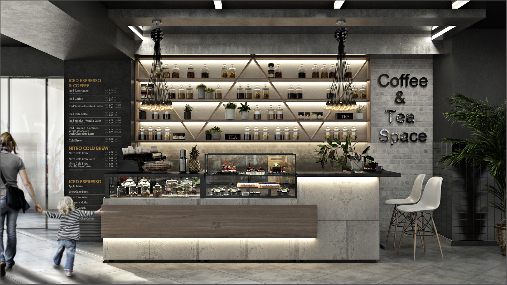

```{r setup, include=FALSE}
knitr::opts_chunk$set(collapse = TRUE, 
                      message = FALSE, 
                     fig.path = "descriptives_files/",
  fig.format = "png")
```

```{r}
library(tidyverse)
library(plotly)
library(ggplot2)
library(knitr)
library(readr)
library(viridis)
```
This section provides an overview of the types of restaurants in Manhattan, their distribution, and the scoring scales used in health inspections.
```{r}
# First, we will import the data and remove rows with missing restaurant name, cuisine type, grade, or score, then create a new variable called region

manhattan_data = read_csv("Manhattan_Restaurant_Inspection_Results.csv", na = c("NA", "", "."))
str (manhattan_data)

cleaned_data = manhattan_data %>%
  janitor::clean_names() %>%  
  filter(
    !is.na(dba),                         
    !is.na(cuisine_description),       
    !is.na(grade),                       
    !is.na(score),                       
    !is.na(zipcode)
  ) %>% mutate(region = case_when(
    zipcode >= 10000 & zipcode <= 10025 ~ "Downtown",
    zipcode >= 10026 & zipcode <= 10040 ~ "Midtown",
    zipcode >= 10041 & zipcode <= 10282 ~ "Uptown",
    TRUE ~ "Other" 
  ))

top_10_cuisines = cleaned_data %>%
  count(cuisine_description, sort = TRUE) %>%
  slice_max(n, n = 10) %>%
  pull(cuisine_description)

filtered_data = cleaned_data %>%
  filter(cuisine_description %in% top_10_cuisines) 
```

### Types of Restaurants

#### Let's explore the restaurants distribution across Mahattan
```{r}
selected_cuisines <- c(
  "Sandwiches", "French", "Mexican", "Bakery Products/Desserts",
  "Pizza", "Japanese", "Italian", "Chinese", "Coffee/Tea", "American"
)

filtered_restaurant_data <- filtered_data %>%
  filter(cuisine_description %in% selected_cuisines) %>%  
  distinct(camis, .keep_all = TRUE)                      


filtered_restaurant_data <- filtered_restaurant_data %>%
  mutate(
    hover_info = paste(
      "CAMIS:", camis, "<br>",
      "DBA:", dba, "<br>",
      "Grade:", grade, "<br>",
      "Cuisine:", cuisine_description
    )
  )


restaurant_map <- plot_ly(
  data = filtered_restaurant_data,
  lat = ~latitude,         
  lon = ~longitude,         
  type = 'scattermapbox',
  mode = 'markers',
  text = ~hover_info,      
  hoverinfo = 'text',
  marker = list(size = 8, opacity = 0.8), 
  color = ~cuisine_description,          
  colors = viridis_pal(option = "D")(length(selected_cuisines)) 
) %>%
  layout(
    mapbox = list(
      style = "carto-positron", 
      zoom = 10,                 
      center = list(
        lat = mean(filtered_restaurant_data$latitude, na.rm = TRUE),
        lon = mean(filtered_restaurant_data$longitude, na.rm = TRUE)
      )
    ),
    title = list(  
      text = "Demographics of Manhattan Restaurants",  
      font = list(size = 18)                           
    )
  )


restaurant_map
```

The map highlights the `high concentration of restaurants in Midtown and Downtown` Manhattan, reflecting the dense commercial and residential areas in these neighborhoods. In contrast, `fewer restaurants are observed in Uptown` Manhattan, where the population density and commercial activity are relatively lower.

By hovering over a point, detailed information about a specific restaurant is displayed, including its `unique identifier (CAMIS), name (DBA), cuisine type, and hygiene grade`. Our feature aims to provide an additional layer of interactivity, allowing users to explore the data in depth.

#### What are the top 10 cuisine types in Manhattan?
```{r}
# Create an EDA histogram using plotly
cuisine_plot = filtered_data %>%
  distinct(camis, dba,cuisine_description) %>% 
  count(cuisine_description) %>% 
  mutate(cuisine_description = fct_reorder(cuisine_description, n)) %>% 
  plot_ly(
    x = ~cuisine_description, 
    y = ~n,
    type = 'bar',
    color = ~cuisine_description,
    colors = "viridis") %>% 
  layout(
    title = "Top 10 Cuisine Types in Manhattan",
    xaxis = list(title = "Cuisine Type"),   
    yaxis = list(title = "Count N") 
  )

cuisine_plot
```
The 2456 `American` cuisine restaurants `dominates the dining scene`, reflecting its widespread appeal and availability. Popular cuisines such as `Chinese, Italian, and Japanese` highlight Manhattan's `global culinary diversity`, catering to a broad range of tastes. 

We find out that `1062 coffee and tea establishments are notably abundant`, suggesting a strong demand for quick-service options among the busy urban population. Meanwhile, niche categories like bakery products, sandwiches, and French cuisine add variety to the dining landscape. Our plot underscores the `rich and diverse food` culture that defines `Manhattan`.

<br><br> 
  
::: {style="display: flex; justify-content: center; gap: 20px;"}

<div style="width: 45%; text-align: center;">

```{r, echo=FALSE, out.width="100%", fig.align='center'}
knitr::include_graphics("./pictures/americanfood.webp")
```

<p>American Food</p> </div> <div style="width: 45%; text-align: center;"> 

```{r, echo=FALSE, out.width="100%", fig.align='center'} 
 
```

<p>Coffee and Tea</p> </div>

:::
  
::::

### Restaurant Grades by Cuisine

#### How Do Different Cuisine Types in Manhattan Fare in Health Inspections?

*`Restaurant Hygiene Inspection Grading System:`

*`A: Grade A – The highest level of food safety and hygiene standards.`
*`B: Grade B – Satisfactory hygiene, but improvements are recommended.`
*`C: Grade C – Subpar hygiene, requiring immediate improvements.`
*`Z: Grade Pending – Awaiting a finalized grade post-inspection.`
*`P: Grade Pending (Reopening) – Issued to establishments reopening after a closure due to prior violations.`
*`N: Not Yet Graded – Inspection completed, but a grade has not been assigned yet.`

```{r}

# Reorder 'grade' factor levels
filtered_data <- filtered_data %>%
  mutate(grade = factor(grade, levels = c("Z", "P", "N", "C", "B", "A")))  # Order Z -> A

# Calculate proportions for each cuisine and grade
proportion_data <- filtered_data %>%
  group_by(cuisine_description, grade) %>%
  summarise(count = n(), .groups = 'drop') %>%
  group_by(cuisine_description) %>%
  mutate(proportion = count / sum(count)) %>%
  ungroup()

# Create the plot
plot <- plot_ly(
  data = proportion_data,
  x = ~cuisine_description,
  y = ~proportion,
  color = ~grade,
  colors = viridis(256),
  type = "bar",
  hoverinfo = "text",
  text = ~paste("Cuisine Type:", cuisine_description,
                "<br>Grade:", grade,
                "<br>Proportion:", round(proportion, 2))
) %>%
  layout(
    barmode = "stack",
    title = "Grade Distribution of Top 10 Cuisine Types",
    xaxis = list(title = "Cuisine Type", tickangle = 45),
    yaxis = list(title = "Proportion"),
    legend = list(title = list(text = "Grade"))
  )

plot
```

The chart shows that most restaurants in Manhattan maintain high hygiene standards, with`Grade A` being the most common, ranging from 50% to 80%. `Coffee/Tea` (80%) and `French` (70%) cuisines have the highest percentage of `Grade A`, while `Bakery Product/Desserts` (50%) have the lowest,indicating areas for improvement. `Chinese` and `Japanese` restaurants have more variability, with higher proportions of `lower grades` (B and c) and pending, grades (z and P) , suggesting these cuisines might need extra attention to improve food safety.

```{r, echo=FALSE, out.width="60%", fig.align='center'}
knitr::include_graphics("./pictures/sanitary.jpg")
```
<center> <p>NYC restaurant inspection grade</p> </div>